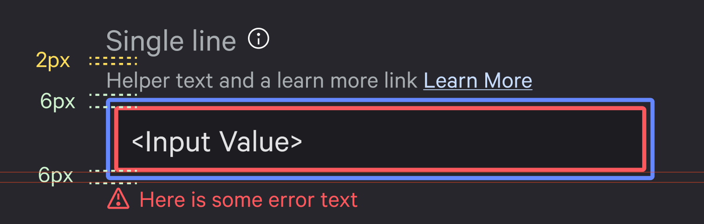

# Field

Field is a component to aid in creating form components. 
It provides a label, hint sections for things like help text, a control block, and an error section for rendering errors. 
It allows users to provide custom controls with a consistent form-element shell and is not opinionated on what underlying control element is used.

## Yielded Items

- `id`: A unique ID to provide to the control element `id` attribute and the Label component `for` attribute.
- `hintId`: A unique ID to provide to the control element `aria-describedby` attribute and the Hint component `id` attribute.
- `errorId`: A unique ID to provide to the control element `aria-describedby` or `aria-errormessage` attribute and the Error component `id` attribute.
- `Label`: Renders a `<label>` element. Form element label text is normally rendered here.
- `Hint`: Renders a `<div>` element. Help text or supplemental information is normally rendered here.
- `Control`: A control block where a form element is rendered, for example, an `<input>`, `<textarea>`, etc.
- `Error`: Renders a `<div>` element. Error information is normally rendered here. It accepts an `@error` argument that is either a string or array of strings. If provided with an array of strings, the errors will be rendered in a `<ul>` + `<li>`.

## Design Guidelines



- Spacing between the label and the hint should be 0.125rem/2px.
- Spacing between the hint and the control should be 0.375rem/6px.
- Spacing between the control and the error should be 0.375rem/6px.
- If there is no hint, the spacing between the label and the control should be 0.375rem/6px.

It is up to consumers to apply these classes themselves. If using our Toucan `*Field` components, we handle this automatically.

## Accessibility

The Field component does not handle accessibility automatically for the label, hint, and error sections of the component; however, it does provide identifiers to assist here. Each code example on this page also shows how to take advantage of these IDs.

- [for](https://developer.mozilla.org/en-US/docs/Web/HTML/Attributes/for)
- [aria-describedby](https://developer.mozilla.org/en-US/docs/Web/Accessibility/ARIA/Attributes/aria-describedby)
- [aria-errormessage](https://developer.mozilla.org/en-US/docs/Web/Accessibility/ARIA/Attributes/aria-errormessage)
- [aria-invalid](https://developer.mozilla.org/en-US/docs/Web/Accessibility/ARIA/Attributes/aria-invalid)

## Optionally Rendering Components

The yielded components from Field can be optionally rendered by using the `{{#if}}` helper. 
The below example optionally renders the Hint and Error based on component arguments.

```hbs
<Form::Field as |field|>
  <field.Label for={{field.id}}>{{@label}}</field.Label>

  {{#if @helperText}}
    <field.Hint id={{field.hintId}}>{{@helperText}}</field.Hint>
  {{/if}}

  <field.Control>
    <input id={{field.id}} aria-describedby={{field.hintId}} aria-invalid={{if @error "true"}} aria-errormessage={{if @error field.errorId}}class='border-critical bg-blue' ...attributes />
  </field.Control>

  {{#if @error}}
    <field.Error id={{field.errorId}} @error={{@error}} />
  {{/if}}
</Form::Field>
```

### Attributes and Modifiers

Optional.

Attributes are spread to each sub component of the Field via `...attributes`, so HTML attributes and Ember modifiers can be added.

```hbs
<Form::Field as |field|>
  <field.Label
    for={{field.id}}
    class='mt-3'
    data-test-label
    {{on 'hover' this.onLabelHover}}
  >First name</field.Label>
  {{! other components below ...}}
</Form::Field>
```

### Ordering of Components

Ordering of the elements can be changed by adjusting the order of the children. 
For example, if it is preferred to put the hint block underneath the control.

```hbs
<Form::Field as |field|>
  <field.Label for={{field.id}}>First name</field.Label>
  <field.Control>
    <input id={{field.id}} aria-describedby={{field.hintId}} ...attributes />
  </field.Control>
  <field.Hint id={{field.hintId}}>Hint text below the input</field.Hint>
</Form::Field>
```
